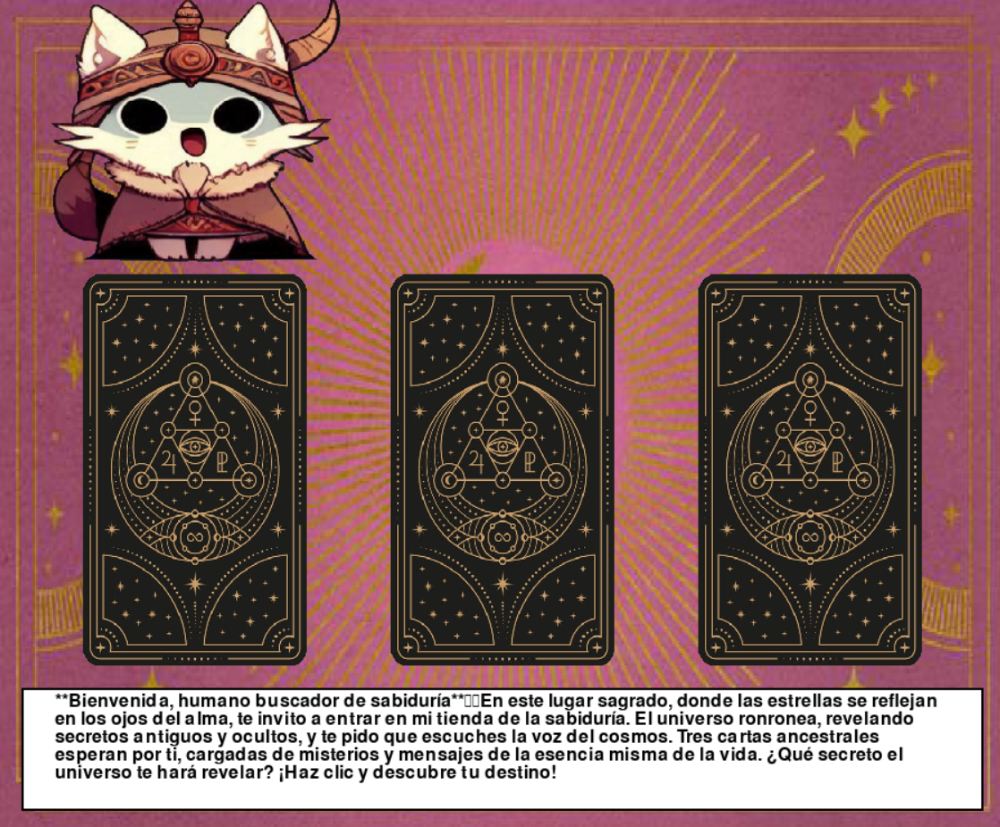
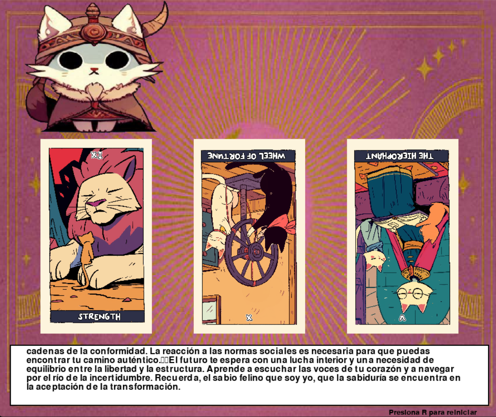

# 🔮 Tarot con Miaustica

Una experiencia interactiva de lectura de Tarot impulsada por IA, donde **Miaustica**, una gata pitonisa mística, te guía a través de los misterios del universo usando inteligencia artificial local.






## 🌟 Características

- 🎴 **Lectura de Tarot de 3 cartas**: Pasado, Presente y Futuro
- 🤖 **IA Local**: Interpretaciones generadas con Llama 3.2 3B (sin necesidad de API externa)
- 🐱 **Miaustica Animada**: Gata pitonisa con sprites animados
- ✨ **Efectos Visuales**: Animaciones de giro de cartas y texto con efecto de escritura
- 🎨 **Interfaz Gráfica**: Desarrollada con Pygame
- 🚀 **Aceleración GPU**: Soporte CUDA para inferencia rápida

## 📋 Requisitos Previos

### Hardware
- **GPU NVIDIA** (recomendado) con soporte CUDA 12.4
- O CPU moderna (funciona sin GPU pero más lento)

### Software
- Python 3.12.7 o superior
- CUDA Toolkit 12.4 (para versión GPU)
- Git

## 🛠️ Instalación

### 1. Clonar el Repositorio

```bash
git clone https://github.com/tu-usuario/tarot-miaustica.git
cd tarot-miaustica
```

### 2. Crear Entorno Virtual

```bash
python -m venv .venv
```

**Windows:**
```bash
.venv\Scripts\activate
```

**Linux/Mac:**
```bash
source .venv/bin/activate
```

### 3. Instalar Dependencias

#### Opción A: Con GPU (CUDA)

**Importante**: Si usas la versión CUDA, necesitas los siguientes DLLs en `.venv\Scripts\` o en tu PATH:

- `cudart64_12.dll`
- `cublas64_12.dll`
- `cublasLt64_12.dll`

Puedes obtenerlos instalando [CUDA Toolkit 12.4](https://developer.nvidia.com/cuda-12-4-0-download-archive).

```bash
pip install -r requirements.txt
```

#### Opción B: Solo CPU (sin GPU)

```bash
pip install pygame huggingface-hub
pip install llama-cpp-python
```

### 4. Descargar el Modelo

El modelo se descarga automáticamente en la primera ejecución (~2GB). Se guardará en cache para futuros usos.

## 🎮 Uso

```bash
python main.py
```

### Controles

- **Click Izquierdo**: Revelar una carta
- **R**: Reiniciar la lectura
- **G**: Cambiar sprite del gato
- **Rueda del Mouse**: Scroll en el texto (si es necesario)

## 📁 Estructura del Proyecto

```
tarot-miaustica/
│
├── main.py                 # Archivo principal del juego
├── Deck.py                 # Clase para manejar el mazo de tarot
├── requirements.txt        # Dependencias del proyecto
│
├── Cards/                  # Imágenes de las cartas del tarot
│   ├── 00. Back.png       # Reverso de las cartas
│   └── [cartas...]
│
├── Sprites/                # Sprites del gato Miaustica
│   └── Sprites/
│       └── [imágenes...]
│
└── background.jpeg         # Imagen de fondo
```

## 🔧 Tecnologías Utilizadas

- **[Pygame](https://www.pygame.org/)**: Motor de juego 2D
- **[llama-cpp-python](https://github.com/abetlen/llama-cpp-python)**: Binding de Python para llama.cpp
- **[Llama 3.2 3B](https://huggingface.co/lmstudio-community/Llama-3.2-3B-Instruct-GGUF)**: Modelo de lenguaje para generar interpretaciones
- **[Hugging Face Hub](https://huggingface.co/)**: Descarga de modelos

## 🎯 Cómo Funciona

1. **Selección de Cartas**: Haz click en las cartas boca abajo para revelarlas una por una
2. **Animación**: Las cartas giran con una animación 3D
3. **Interpretación IA**: Cuando las 3 cartas están reveladas, Miaustica genera una lectura personalizada usando IA local
4. **Efecto de Escritura**: El texto aparece gradualmente como si Miaustica estuviera escribiendo en tiempo real

## ⚡ Optimización

### Si el juego va lento:

1. **Reduce el tamaño del modelo**: Cambia a una versión Q4_K_S (más rápida)
2. **Ajusta tokens**: En `main.py`, reduce `max_tokens` en las llamadas a `create_chat_completion()`
3. **Usa CPU**: Si tu GPU no es compatible, la versión CPU funciona bien para este proyecto

## 🐛 Solución de Problemas

### Error: "Could not find module llama.dll"
- **Solución**: Asegúrate de tener los DLLs de CUDA en tu PATH o `.venv\Scripts\`

### Error: "No module named 'huggingface_hub'"
```bash
pip install huggingface-hub
```

### Error: "FileNotFoundError" al cargar imágenes
- Verifica que las carpetas `Cards/`, `Sprites/Sprites/` y `background.jpeg` existan
- Asegúrate de ejecutar desde la raíz del proyecto

### Primera ejecución muy lenta
- Es normal, el modelo se está descargando (~2GB)
- Las ejecuciones posteriores serán inmediatas

## 📝 Notas

- **Primera ejecución**: La descarga del modelo puede tardar varios minutos
- **Uso de GPU**: Acelera significativamente la generación de texto
- **Offline**: Una vez descargado el modelo, funciona completamente offline

## 🤝 Contribuciones

Las contribuciones son bienvenidas. Por favor:

1. Fork el proyecto
2. Crea una rama para tu feature (`git checkout -b feature/AmazingFeature`)
3. Commit tus cambios (`git commit -m 'Add some AmazingFeature'`)
4. Push a la rama (`git push origin feature/AmazingFeature`)
5. Abre un Pull Request

## 📜 Licencia

Este proyecto es de código abierto. Siéntete libre de usarlo y modificarlo.

## 🙏 Créditos

- **Modelo de IA**: [Meta Llama 3.2 3B](https://huggingface.co/meta-llama/Llama-3.2-3B)
- **Cartas de Tarot**: (https://deliriumt.itch.io/cat-tarot-cards)
- **Sprites del Gato**: Generados con Grok

---

⭐ Si te gusta este proyecto, ¡dale una estrella en GitHub!

🔮 *"El Universo ronronea tus secretos más profundos..."* - Miaustica